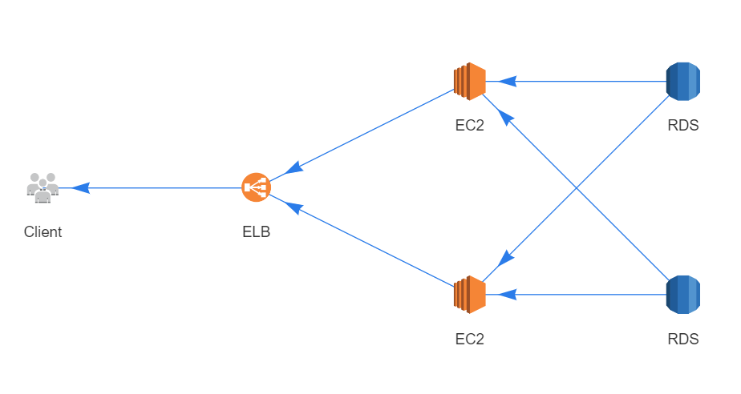

# Diagram as code

This library allows you to easily create diagrams of your infrastructure in code. The library aims to make creating a new diagram and changing an existing one extremely easy, requiring only a text editor.

An example of a diagram that can be created with this library:



To generate this diagram, we use the following code as specified in [example.html](./example.html):

```js
const { diagram, dac: { Client, Elb, Ec2Cluster, RdsCluster } } = window;

const client = new Client();
const loadbalancer = new Elb();
const webserver = new Ec2Cluster();
const databases = new RdsCluster();

client.getsDataFrom(loadbalancer);
loadbalancer.getsDataFrom(webserver);
webserver.getsDataFrom(databases);

diagram.render();
```

## Getting started

Follow these steps to get started:

- Download the file [example.html](./example.html).
- Change the body to reflect your infrastructure. See the reference below for a list of what's possible.
- Open it in your browser.

## Reference

### Adding nodes to a diagram

To create a new node, create a new instance of the class you want:

```js
const customer = new Client('Customer');
```

The node will automatically be added to the diagram. All node types can be supplied with a label as the first argument of the constructor.

### Linking nodes together

There are three ways to specify data flow between nodes. An example for the nodes customer and server:

```js
customer.exchangesDataWith(server);
customer.getsDataFrom(server);
customer.sendsDataTo(server);
```

### Rendering the diagram

To render the diagram:

```js
diagram.render();
```

You can also send some settings via the render function:

```js
diagram.render({
    leftToRight: false,
    container: document.body
});
```

The values shown are the defaults.

### Customizing positioning

In most cases, the way the nodes are layed out will make sense. If it doesn't, you can customize the layers of the nodes. Add the layer as the second parameter to any node:

```js
const layerNumber = 3;
const customer = new Client('Customer', layerNumber);
```

> Important: You'll have to specify the layer for all nodes in your diagram to make this work.

### Available node types

The following node types are currently available:

```text
Client, Server, ServerCluster, Database, DatabaseCluster, Mysql, MysqlCluster, Oracle, OracleCluster, PostgreSql, PostgreSqlCluster, Elasticsearch, ElasticsearchCluster, Ec2, Ec2Cluster, Rds, RdsCluster, Elb, S3, DynamoDb, Redshift, Cloudwatch, Elasticache, Iam, SimpleDb, Swf, Cloudfront, Sqs, Sns, Route53, StorageGateway, CloudFormation, CloudSearch, Glacier, ElasticBeanstalk, Ebs, Lambda, ApiGateway
```

Each of these will get a nice icon when you use them. If you want to add something that is not in this list, you can use the `Custom` type:

```js
const instanceCount = 17;
const layerNumber = 3;
const customNode = new Custom(
    'Custom label',
    'https://custom.icon.website.org/icon.png',
    layerNumber,
    instanceCount
);
```
